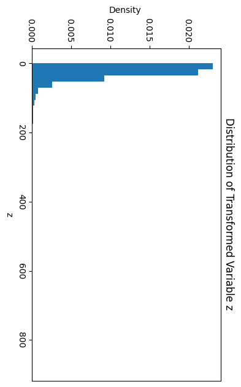
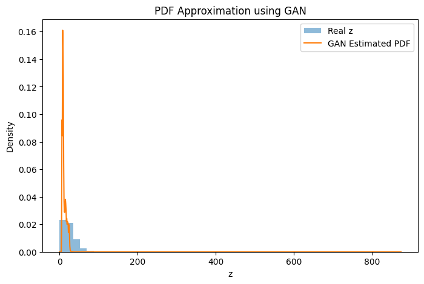

# Assignment 2 – Learning Probability Density Functions Using GANs
# Learning Probability Density Functions using GANs

## 📌 Overview
This project aims to estimate the probability density function (PDF) of an unknown random variable using only observed data samples. A Generative Adversarial Network (GAN) is used to learn the underlying distribution implicitly, without assuming any analytical or parametric form.

The experiment is performed on **NO₂ concentration data**, which is first transformed using a nonlinear function and then modeled using a GAN.

---

## 📊 Dataset
- **Feature:** NO₂ concentration  
- **Source:** India Air Quality Dataset (Kaggle)  
- **Preprocessing:**
  - Selected only the NO₂ column
  - Removed missing values
  - Normalized the data before training

---

## 🔄 Data Transformation
Each NO₂ value \( x \) is transformed using the nonlinear function:

\[
z = x + a_r \sin(b_r x)
\]

where:
- \( r \) is the university roll number  
- \( a_r = 0.5 \times (r \bmod 7) \)  
- \( b_r = 0.3 \times ((r \bmod 5) + 1) \)

### Parameters Used (Roll No: 102303701)
- \( a_r = 1.5 \)
- \( b_r = 0.6 \)

Final transformation:
\[
z = x + 1.5 \sin(0.6x)
\]

---

## 📈 Distribution of Transformed Data
The empirical distribution of the transformed variable \( z \) is shown below.

---

## 🧠 GAN Architecture

### Generator
- Input: Gaussian noise sampled from \( \mathcal{N}(0,1) \)
- Output: Generated samples of the transformed variable
- Architecture: Fully connected neural network with ReLU activations

### Discriminator
- Input: Real or generated samples
- Output: Probability of the input being real
- Architecture: Fully connected neural network with Sigmoid activation at the output

---

## ⚙️ Training Details
- Loss function: Binary Cross Entropy
- Optimizer: Adam
- Learning rate: 0.001
- Epochs: 3000
- Batch size: 128

No parametric probability distribution (Gaussian, exponential, etc.) is assumed during training.

---

## 🧪 PDF Estimation
After training the GAN:
1. A large number of samples are generated using the trained generator
2. Kernel Density Estimation (KDE) is applied to approximate the probability density function

---

## 📉 PDF Approximation Results
The plot below compares:
- The empirical distribution of the transformed data
- The PDF estimated from GAN-generated samples

---

## 🔍 Observations
- The GAN captures the overall shape of the transformed distribution
- Training stabilizes after initial epochs
- No significant mode collapse is observed
- Minor deviations occur in the tail regions due to finite sampling
- The distribution is learned directly from data samples without assuming an analytical PDF

---

## ✅ Conclusion
This project demonstrates that Generative Adversarial Networks can effectively learn unknown probability density functions using only sample data. The generator implicitly models the distribution by mapping random noise to the data space, while the discriminator enforces realism through adversarial training.

---

## 🛠 Tools and Libraries
- Python
- NumPy
- Pandas
- Matplotlib
- Scikit-learn
- PyTorch
